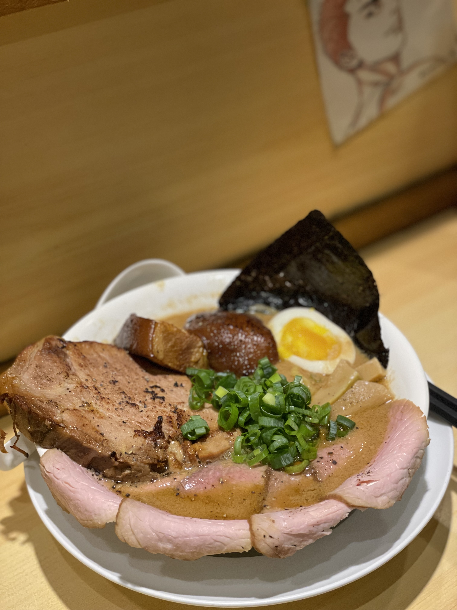
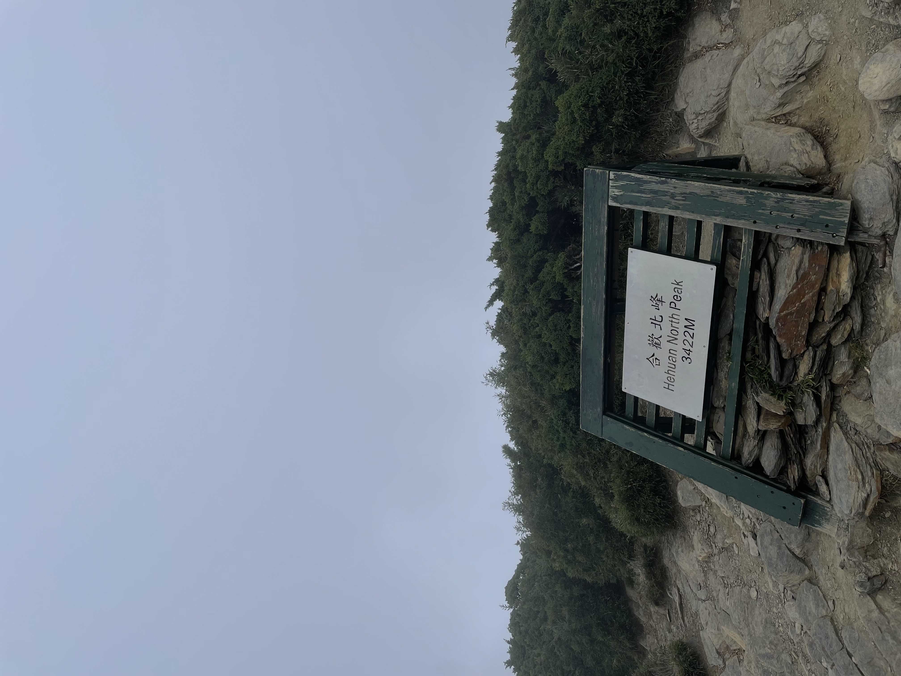
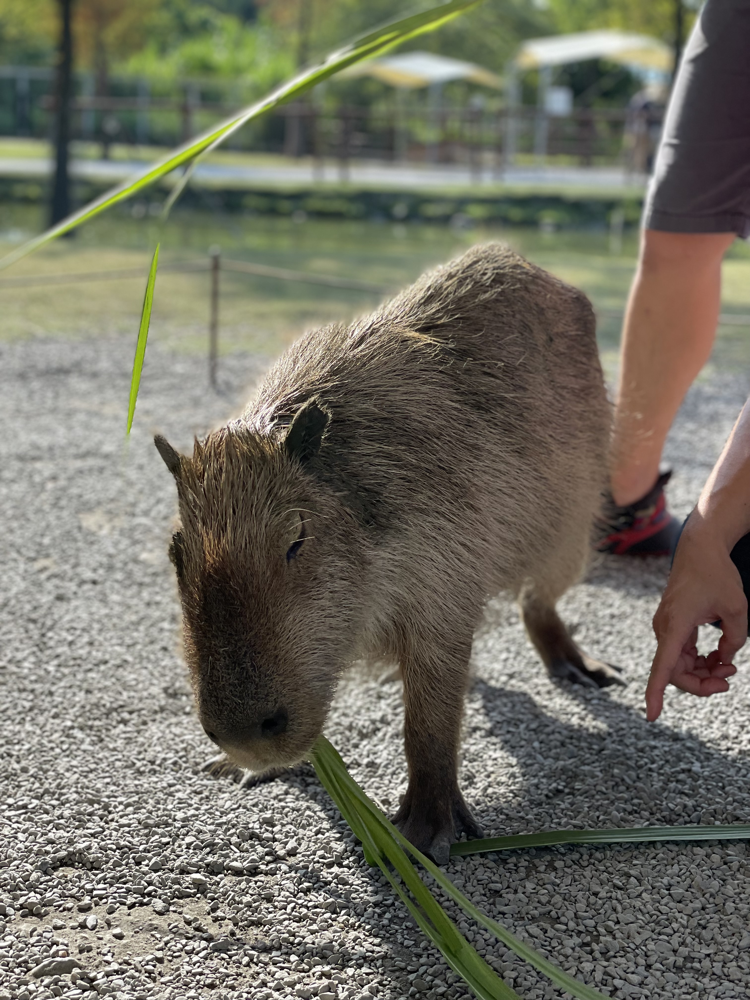

### Hi there 👋

**Hello World!** 

Welcome to My GitHub Profile!

**ABOUT ME** 

My name is Devika Tristha Phylicia. Currently, I am a Global MBA student at Tunghai University. I have an interest in Finance and Accounting field and recently I more into Data Analytics things. I am curious how the profesionals in this field work their job. 

Talk about hobby, I love doing sports. I also like kind of outside activitie like hiking. Sometimes I also did a food photography too and if you guys have an interest in my portfolio please take a look on my Instagram (@Mr.Zima)

This was a photo I took when I reached He Huan Shan in Taiwan. 

**EDUCATION**

I went to Taiwan in 2018 to persue my bechelor degree in Business Administration in Finance and in the last year of my bechelor I have decided to continue my study in Tunghai University as a Global MBA student.

**Short Story of My Journey in Taiwan** 

I went to Taiwan with zero skill in Mandarin and went to a college majoring in Finance with full Mandarin Langauage Courses. I had really a hard time at the moment but I am truly beyond blessed and grateful for that. I often think back about my first year in Taiwan and how it shaped me in so many ways and had shaped me become the person that i am now. 

Here are the people I was met when I was in college, not all but they were in my college memories forever. Wishing all these people healty and find success in every road you step on!! 

I can't believe I've already 5 years here in Taiwan but I am still hoping and looking forward to have a working experience here after I graduated.

ok mas bro 

